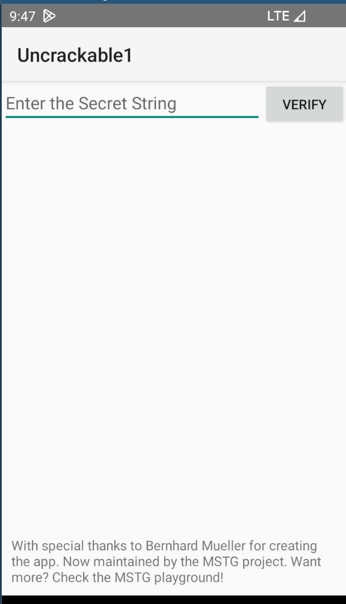
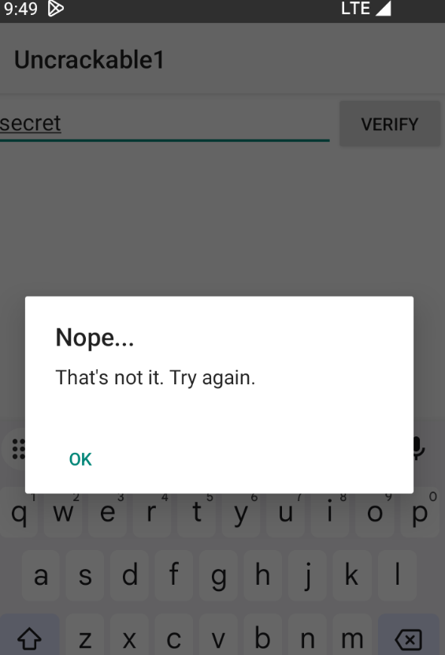
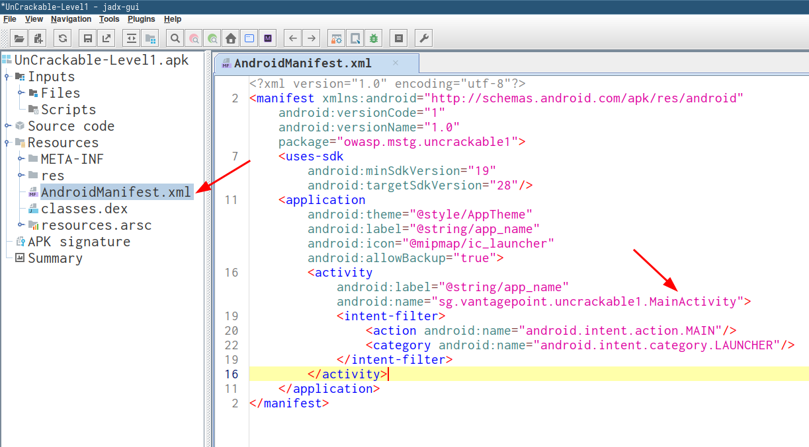
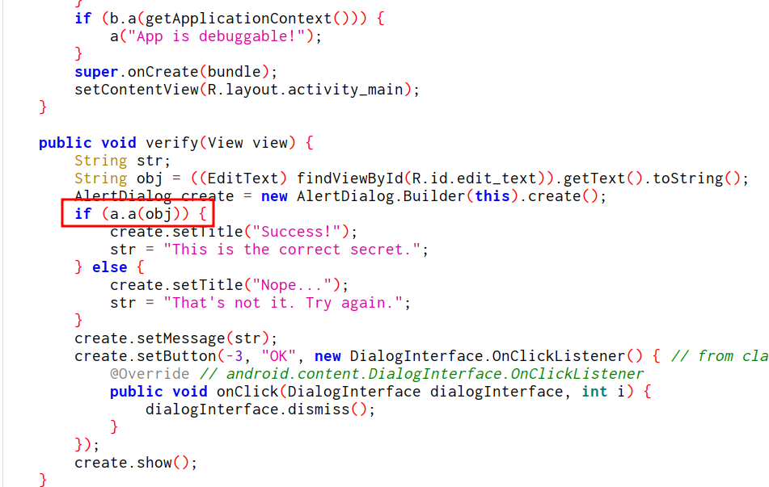
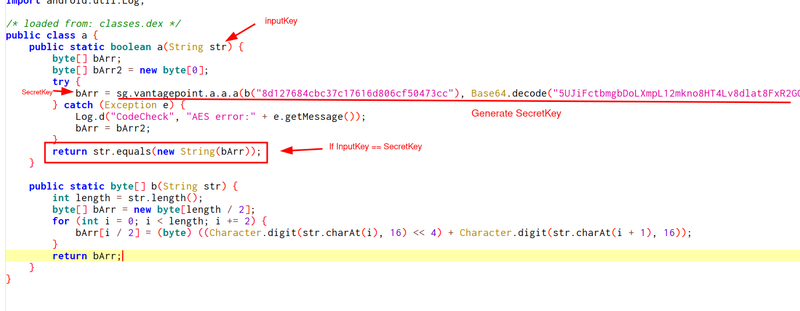
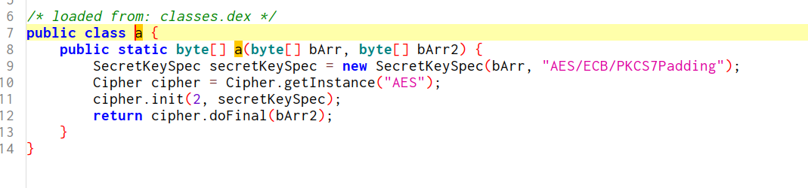
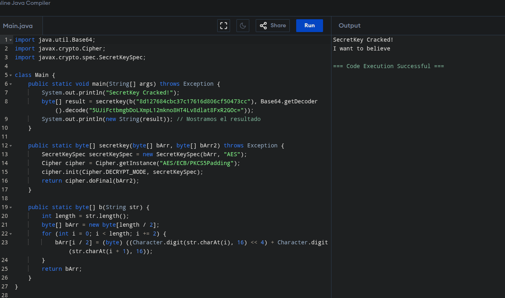
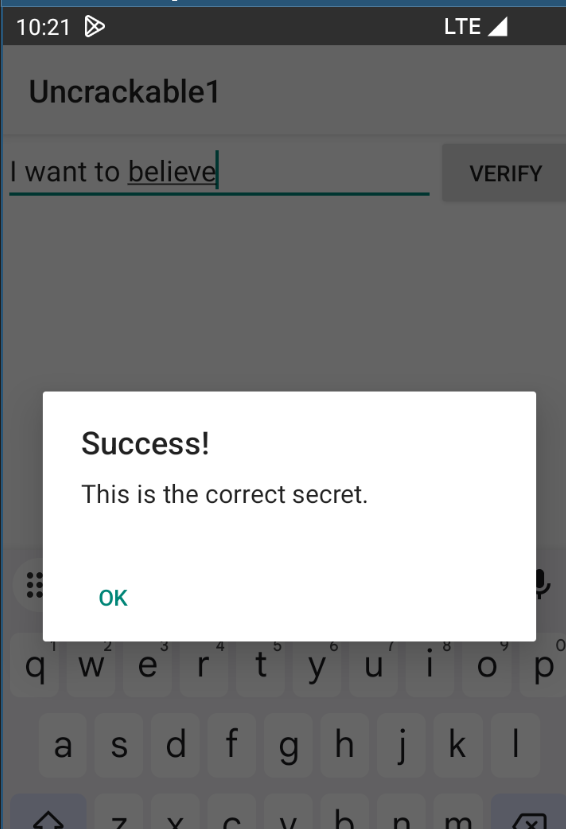

# UnCrackable L1
- Autor: @0xGerard
- Plataforma: Android
- Objetivo: El objetivo de este reto es obtener el texto oculto.
- Crackmes android url: https://mas.owasp.org/crackmes/Android/#android-uncrackable-l1

# Análisis inicial
La aplicación nos solicita ingresar una clave



Al ingresar cualquier clave, nos indica que no es válida.



# Análisis estático
Abrimos la aplicación con `jadx-gui`, selecionamos el archivo `AndroidManifest.xml` y  nos dirigimos a `MainActivity`.



El método `verify` verifica si la clave ingresada es correcta. Si cumple la condiccional donde `a.a(obj)` retorne verdadero, obtendremos el mensaje indicando que la clave es correcta.



La funcion `a` acepta la clave ingresada y es comparada con `bArr`. `bArr` almancena la clave secreta que es generada por el método `sg.vantagepoint.a.a.a`. Esta funcion recibe dos parametros:
- El primero una cadena generada a partir de la funciona `b`, que también recibe una cadena como argumento.
- El segundo un código en base64 que se decodificado.



Finalmente,la función `sg.vantagepoint.a.a.a` realiza una serie de operaciones de cifrado sobre los parámetros recibidos. No entraremos en detalle sobre su funcionamiento interno, ya que no es necesario para resolver el reto.




# Solución: Creamos un programa apartir del código analizado
Para resolver el reto, adaptamos las funciones relevantes en un pequeño programa:

```java
import java.util.Base64;
import javax.crypto.Cipher;
import javax.crypto.spec.SecretKeySpec;

class Main {
    public static void main(String[] args) throws Exception {
        System.out.println("SecretKey cracked!");
        byte[] result = secretkey(b("8d127684cbc37c17616d806cf50473cc"), Base64.getDecoder().decode("5UJiFctbmgbDoLXmpL12mkno8HT4Lv8dlat8FxR2GOc="));
        System.out.println(new String(result)); // Clave secreta
    }

    public static byte[] secretkey(byte[] bArr, byte[] bArr2) throws Exception {
        SecretKeySpec secretKeySpec = new SecretKeySpec(bArr, "AES");
        Cipher cipher = Cipher.getInstance("AES/ECB/PKCS5Padding");
        cipher.init(Cipher.DECRYPT_MODE, secretKeySpec);
        return cipher.doFinal(bArr2);
    }

    public static byte[] b(String str) {
        int length = str.length();
        byte[] bArr = new byte[length / 2];
        for (int i = 0; i < length; i += 2) {
            bArr[i / 2] = (byte) ((Character.digit(str.charAt(i), 16) << 4) + Character.digit(str.charAt(i + 1), 16));
        }
        return bArr;
    }
}
```


Ingresamos la clave obtenida y .. B00M!


