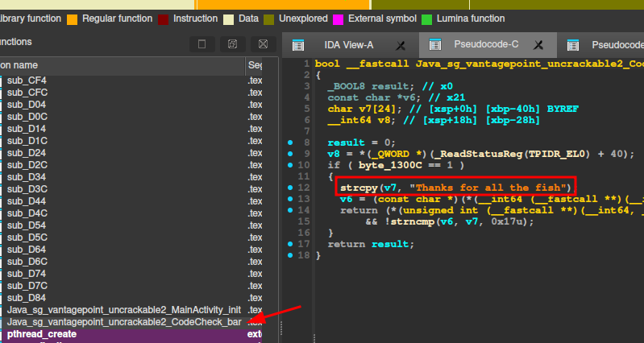

# UnCrackable L1
- Autor: @0xGerard
- Plataforma: Android
- Objetivo: El objetivo de este reto es obtener el texto oculto.
- Crackmes android url: https://mas.owasp.org/crackmes/Android/#android-uncrackable-l2

# Analisis inicial
El analisis es el mismo que `UnCrackable1`: La aplicación nos pide una clave.

# Analisis estático

Nos dirigimos a `MainActivity` y analizamos el método `verify`.

En verify, la condicional `this.m.a(obj)` recibe como parámetro la clave que ingresamos. Si esta cumple con la validación, el método devuelve true y obtenemos acceso a la aplicación.

Al analizar el método `this.m.a`, notamos que llama a `bar`, una función nativa que recibe la clave como argumento.

Revisando `MainActivity`, vemos que se carga la librería `foo`, por lo que la librería nativa en cuestión es `libfoo.so`.

Encontramos la librería dentro de `Resources/lib/`, disponible para todas las arquitecturas.

# Analisis de libfoo.so con IDA
Abrimos el archivos con la herramienta IDA, nos dirigimos al método `Java_sg_vantagepoint_uncrackable2_CodeCheck_bar` y mostramos el código desemamblado.

De ahí obtenemos la clave secreta. La ingresamos en la aplicación y... ¡B00M!

